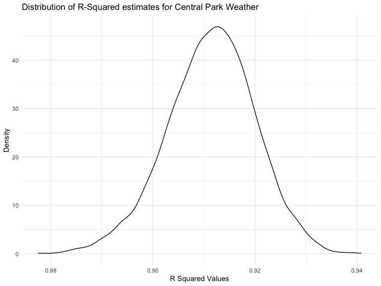
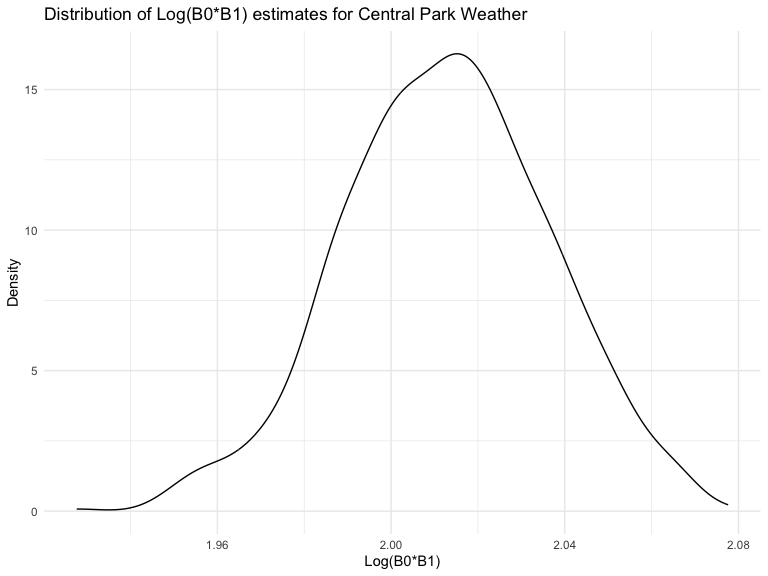
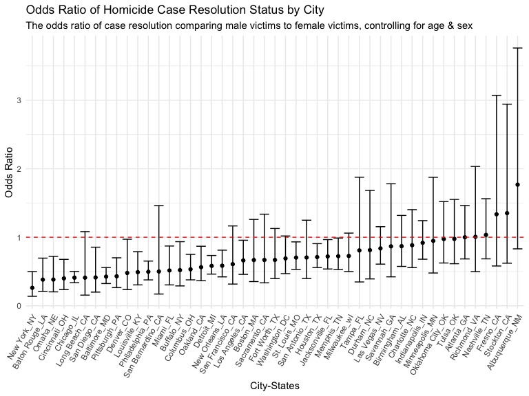
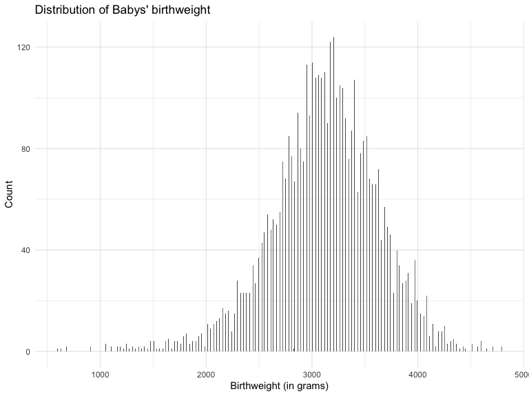
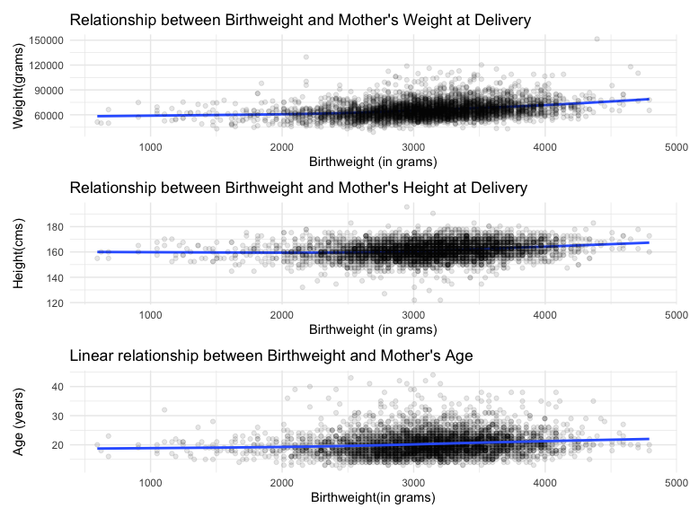
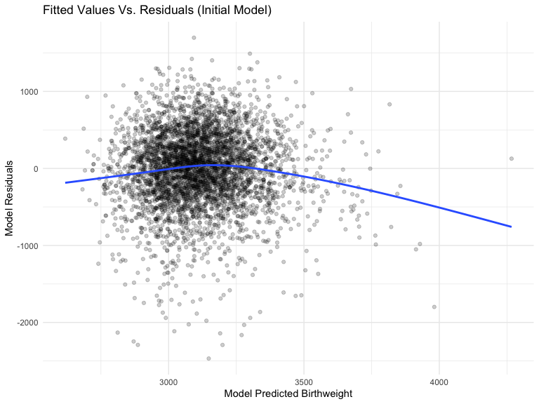
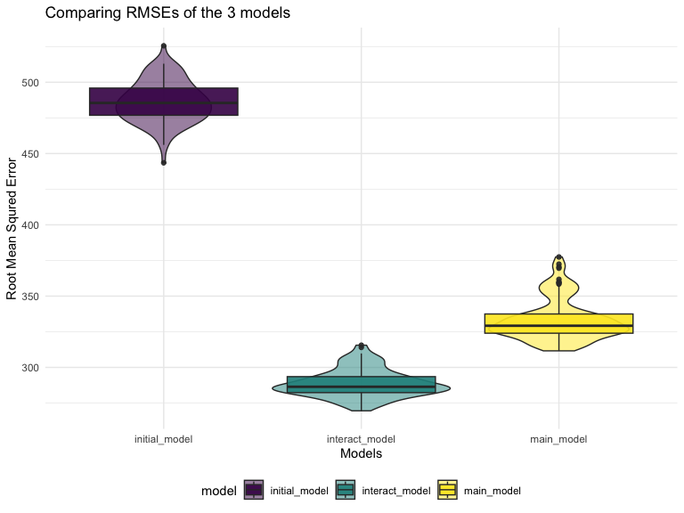
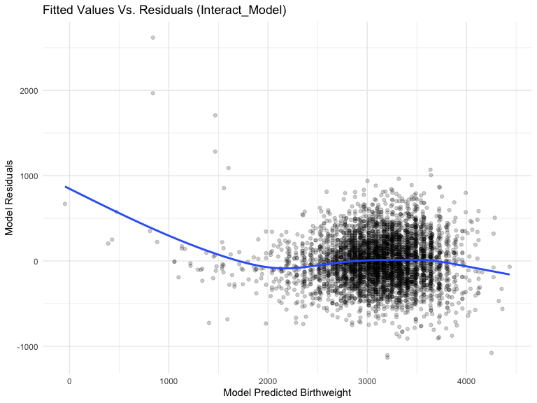

p8105_hw6_mnt2130
================
Mindy Tran
2022-12-03

### Problem 1

This code below obtains a distribution for $\hat{r}^2$ by drawing
bootstrap samples; the a model to each andextracts the value I’m
concerned with and summarizes it summarize. Here, we’ll use
`modelr::bootstrap` to draw the samples and `broom::glance` to produce
`r.squared` values.

``` r
weather_df = 
  rnoaa::meteo_pull_monitors(
    c("USW00094728"),
    var = c("PRCP", "TMIN", "TMAX"), 
    date_min = "2017-01-01",
    date_max = "2017-12-31") %>%
  mutate(
    name = recode(id, USW00094728 = "CentralPark_NY"),
    tmin = tmin / 10,
    tmax = tmax / 10) %>%
  select(name, id, everything())
```

    ## Registered S3 method overwritten by 'hoardr':
    ##   method           from
    ##   print.cache_info httr

    ## file min/max dates: 1869-01-01 / 2022-12-31

``` r
weather_df %>% 
  modelr::bootstrap(n = 5000) %>% 
  mutate(
    models = map(strap, ~lm(tmax ~ tmin, data = .x) ),
    results = map(models, broom::glance)) %>% 
  select(-strap, -models) %>% 
  unnest(results) %>% 
  ggplot(aes(x = r.squared)) + geom_density() +
   labs(
    x = "R Squared Values",
    y = "Density",
    title = "Distribution of R-Squared estimates for Central Park Weather"
  ) 
```



Based on the results, the $\hat{r}^2$ value is high. The upper bound at
1 may be a cause for the generally skewed shape of the distribution. If
we wanted to construct a confidence interval for $R^2$, we could take
the 2.5% and 97.5% quantiles of the estimates across bootstrap samples.
However, since the shape of the curve generated isn’t symmetric, using
the mean +/- 1.96 times the standard error would probably not work well
in this case.

This code produces a distribution for $\log(\beta_0 * \beta1)$ using a
similar approach.

``` r
weather_df %>% 
  modelr::bootstrap(n = 1000) %>% 
  mutate(
    models = map(strap, ~lm(tmax ~ tmin, data = .x) ),
    results = map(models, broom::tidy)) %>% 
  select(-strap, -models) %>% 
  unnest(results) %>% 
  select(id = `.id`, term, estimate) %>% 
  pivot_wider(
    names_from = term, 
    values_from = estimate) %>% 
  rename(beta0 = `(Intercept)`, beta1 = tmin) %>% 
  mutate(log_b0b1 = log(beta0 * beta1)) %>% 
  ggplot(aes(x = log_b0b1)) + geom_density() +
  labs(
    x = "Log(B0*B1)",
    y = "Density",
    title = "Distribution of Log(B0*B1) estimates for Central Park Weather"
  ) 
```



As with $r^2$, this distribution is approximately normally distributed
but also somewhat skewed and potentially has some outliers.

### Problem 2

The following code chunk creates a city_state variable and a binary
variable which indicates whether a homicide is resolved. It also omits
the cities : Tulsa, Dallas, Phoenix, and Kansas which have missing data
or data entry mistakes. We also limited our analyses to victims who were
white or black and converted the variable victim_age to a numeric
variable.

``` r
homicide_df = 
  read_csv("./data/homicide-data.csv", na = c("", "NA", "Unknown")) %>% 
  mutate(
    city_state = str_c(city, state, sep = "_"),
    resolution = case_when(
      disposition == "Closed without arrest" ~ 0,
      disposition == "Open/No arrest"        ~ 0,
      disposition == "Closed by arrest"      ~ 1,
    ),
    victim_age = as.numeric(victim_age)
  ) %>% 
  filter(!city_state %in% c("Tulsa_AL", "Dallas_TX", "Phoenix_AZ","Kansas City_MO"))  %>% 
  filter(victim_race %in% c("Black", "White")) %>% 
  filter(victim_sex %in% c("Male", "Female")) %>%  
  select(city_state, resolution, victim_age, victim_race, victim_sex)
```

    ## Rows: 52179 Columns: 12
    ## ── Column specification ────────────────────────────────────────────────────────
    ## Delimiter: ","
    ## chr (8): uid, victim_last, victim_first, victim_race, victim_sex, city, stat...
    ## dbl (4): reported_date, victim_age, lat, lon
    ## 
    ## ℹ Use `spec()` to retrieve the full column specification for this data.
    ## ℹ Specify the column types or set `show_col_types = FALSE` to quiet this message.

The code below fits a logistic regression of resolved vs unresolved
cases as the outcome and the age,sex, and race of the victims as
predictors for the city of Baltimore and gives the adjusted odds ratio
for solving homicides comparing male victims to female victims keeping
all other variables fixed.

``` r
baltimore_logistic = homicide_df %>% 
  filter(city_state == "Baltimore_MD") %>% 
glm(resolution ~ victim_age + victim_sex + victim_race, family = binomial() , data = .) %>%
  broom::tidy() %>% 
  mutate(
    odds_ratio = exp(estimate),
    ci_lower =  exp(estimate - 1.96 * std.error),
    ci_upper = exp(estimate + 1.96 * std.error)
  ) %>% 
  select(term, odds_ratio, starts_with("CI")) %>% 
  knitr::kable(digits = 3)
baltimore_logistic
```

| term             | odds_ratio | ci_lower | ci_upper |
|:-----------------|-----------:|---------:|---------:|
| (Intercept)      |      1.363 |    0.975 |    1.907 |
| victim_age       |      0.993 |    0.987 |    1.000 |
| victim_sexMale   |      0.426 |    0.325 |    0.558 |
| victim_raceWhite |      2.320 |    1.648 |    3.268 |

The odds of a solved homicide for male victims is 0.426 (CI: 0.325,
0.558) times the odds of a solved homocide for female victims,
controlling for age and race (White or Black).

The code below fits a logistic regression of resolved vs unresolved
cases as the outcome and the age,sex, and race of the victims as
predictors for all cities in the dataset besides the 4 that we excluded
in the data cleaning step.

``` r
models_results = homicide_df %>% 
  nest(data = -city_state) %>% 
  mutate(
    models = map(.x = data, ~ glm(resolution ~ victim_age + victim_sex + victim_race, data = .x, family = binomial())),
    results = map(models, broom::tidy)
  ) %>% 
  select(city_state, results) %>% 
  unnest(results) %>% 
  mutate(
    odds_ratio = exp(estimate),
    ci_lower =  exp(estimate - 1.96 * std.error),
    ci_upper = exp(estimate + 1.96 * std.error)
  ) %>% 
  select(term, odds_ratio, starts_with("CI"))
```

The code below create a plot that shows the estimated ORs and CIs for
each city and organizes the cities according to estimated OR in
ascending order.

``` r
models_results %>% 
  filter(term == "victim_sexMale") %>% 
  mutate(city_state = fct_reorder(city_state, odds_ratio)) %>% 
  ggplot(aes(x = city_state, y = odds_ratio)) + 
  geom_point() + 
  geom_errorbar(aes(ymin = ci_lower, ymax = ci_upper)) +
 theme(axis.text.x = element_text(angle = 60, vjust = 1.0, hjust = 1), legend.position = "none") + 
 geom_hline(yintercept = 1, linetype="dashed", color = "red", linewidth = 0.5) +
  labs(
    title = "Odds Ratio of Homicide Case Resolution Status by City",
    subtitle  = "The odds ratio of case resolution comparing male victims to female victims, controlling for age & sex",
    y = "Odds Ratio",
    x = "City-States"
  )  
```



New York, NY has the lowest odds ratio of case resolution comparing male
victims to female victims when controlling for age and sex. Alberqurque,
NM has the highest odds ratio of case resolution when comparing male
victims to female victims when controlling for age and sex, it also has
the widest confidence interval indicating less reliability when
interpreting this odds ratio estimate. For 15 states, the CI crosses the
odds ratio null value of 1, indicating that the odds ratio generated by
this model is not statistically significant for those states.

### Problem 3

The following code chunk converts `babysex` to a factor variable,
converts both the variables father’s and mother’s race and labels it,
converts mother’s weight at delivery `delwt` to grams and `mheight` to
cm and to keep the same units of measurements as the baby’s. It also
checks for missing values in the data, which there are none.

``` r
baby_df = 
  read_csv("./data/birthweight.csv") %>%
  mutate(
    babysex = ifelse(babysex == 1, "male", "female") %>% as.factor(),
    frace = 
      case_when(
        frace == 1 ~ "White",
        frace == 2 ~ "Black",
        frace == 3 ~ "Asian",
        frace == 4 ~ "Puerto Rican",
        frace == 8 ~ "Other",
        frace == 9 ~ "Unknown",
        TRUE ~ ""
      ) %>% as.factor(),
    mrace = 
      case_when(
        mrace == 1 ~ "White",
        mrace == 2 ~ "Black",
        mrace == 3 ~ "Asian",
        mrace == 4 ~ "Puerto Rican",
        mrace == 8 ~ "Other",
        TRUE ~ ""
      ) %>% as.factor(),
    mrace = fct_relevel(mrace, "Other"),
    delwt = delwt*453.592 %>% round(2),
    mheight = mheight*2.54 %>% round(2)
  )

baby_df %>% skimr::skim() %>% select(skim_variable, n_missing, complete_rate) %>% knitr::kable()
```

| skim_variable | n_missing | complete_rate |
|:--------------|----------:|--------------:|
| babysex       |         0 |             1 |
| frace         |         0 |             1 |
| mrace         |         0 |             1 |
| bhead         |         0 |             1 |
| blength       |         0 |             1 |
| bwt           |         0 |             1 |
| delwt         |         0 |             1 |
| fincome       |         0 |             1 |
| gaweeks       |         0 |             1 |
| malform       |         0 |             1 |
| menarche      |         0 |             1 |
| mheight       |         0 |             1 |
| momage        |         0 |             1 |
| parity        |         0 |             1 |
| pnumlbw       |         0 |             1 |
| pnumsga       |         0 |             1 |
| ppbmi         |         0 |             1 |
| ppwt          |         0 |             1 |
| smoken        |         0 |             1 |
| wtgain        |         0 |             1 |

## Initial model for birthweight

Using a hypothesis driven approach, a mother’s age, weight, and height
influence a baby’s birthweight by proxy of genetics and existing
literature that confirms the correlation. Therefore, we will build a
model that fits a regression for the outcome of baby’s birthweight using
the mother’s age, weight, and height as predictor variables to test the
hypothesis that a baby’s birthweight can be explained by a linear
relationship with their mother’s weight, while controlling for mother’s
age and height.

The following code chunks tests for normality and linearity.

``` r
baby_df %>% 
  ggplot(aes(x = bwt)) +
  geom_histogram(binwidth = 5) + 
  labs(
    title = "Distribution of Babys' birthweight",
    y = "Count",
    x = "Birthweight (in grams)"
  )
```



``` r
bwt_delwt = baby_df %>% 
  ggplot(aes(x = bwt, y = delwt)) + 
  geom_smooth(se = F) + 
  geom_point(alpha = 0.1) + 
    labs(
    title = "Relationship between Birthweight and Mother's Weight at Delivery ",
    y = "Weight(grams)",
    x = "Birthweight (in grams)"
  )
bwt_mheight = baby_df %>% 
  ggplot(aes(x = bwt, y = mheight)) + 
  geom_smooth(se = F) + 
  geom_point(alpha = 0.1) + 
  labs(
    title = "Relationship between Birthweight and Mother's Height at Delivery ",
    y = "Height(cms)",
    x = "Birthweight (in grams)"
  )
bwt_momage = baby_df %>% 
  ggplot(aes(x = bwt, y = momage)) + 
  geom_point(alpha = 0.1) + 
  geom_smooth(se = F) + 
    labs(
    title = "Linear relationship between Birthweight and Mother's Age",
    y = "Age (years)",
    x = "Birthweight(in grams)"
  )
bwt_delwt / bwt_mheight / bwt_momage 
```


The histogram of the outcome baby’s birth weight appears to follow a
normal distribution. The relationship with the 3 predictor variables
(mother’s: weight, height and age) appear to be mostly linear
relationship with the outcome of interest.

The following code chunks fits a linear regression model and gives a
summary of the model and estimates generated from the model.

``` r
lin_fit = 
  baby_df %>% 
lm(bwt ~ delwt + mheight + momage, data = .) 
```

**Model summary**

``` r
lin_fit %>% 
  broom::glance() %>% 
  select(r.squared, adj.r.squared, sigma, statistic, p.value, df, nobs) %>% 
  knitr::kable(digits = 2)
```

| r.squared | adj.r.squared |  sigma | statistic | p.value |  df | nobs |
|----------:|--------------:|-------:|----------:|--------:|----:|-----:|
|       0.1 |           0.1 | 485.73 |    162.69 |       0 |   3 | 4342 |

It appears that the initial model, with an r.squared value of 0.1, only
explains about 10% of the variation in the outcome variable: baby’s
`birthweight`

**Model estimates**

``` r
lin_fit %>% 
  broom::tidy() %>% 
  knitr::kable(digits = 3)
```

| term        | estimate | std.error | statistic | p.value |
|:------------|---------:|----------:|----------:|--------:|
| (Intercept) | 1030.701 |   179.499 |     5.742 |       0 |
| delwt       |    0.013 |     0.001 |    15.668 |       0 |
| mheight     |    5.957 |     1.203 |     4.951 |       0 |
| momage      |   14.381 |     1.914 |     7.515 |       0 |

The model has an adjusted r-squared value of 0.1, indicating that 10% of
the variation in birth weight is explained by mother’s weight, age, and
height.

The following code plots residuals vs. fitted values of the initial
model

``` r
baby_df %>%  
  add_residuals(lin_fit) %>% 
  add_predictions(lin_fit) %>% 
  ggplot(aes(x = pred, y = resid)) + 
  geom_point(alpha = .2) + 
  geom_smooth(se = F) + 
  labs(
    title = "Fitted Values Vs. Residuals (Initial Model)",
    x = "Model Predicted Birthweight",
    y = "Model Residuals"
  )
```

    ## `geom_smooth()` using method = 'gam' and formula = 'y ~ s(x, bs = "cs")'


Based on the plot, the model seems uniformly distributed indicating that
the variance of the errors is constant. However, there seems to be a
curved trend in the model residuals in comparison to the birthweight,
indicating that the model might have some shortcomings when trying to
predict birthweight from our predictor variables.

## Building two additional models

Model 2 uses baby’s birth weight as the outcome with birth length and
gestational age as predictors

Model 3 uses head circumference, length, sex, and an interaction term
between the three predictors.

``` r
#model 2 -
baby_df %>% 
lm(bwt ~ blength + gaweeks, data = .) %>% 
  broom::tidy() %>% 
  knitr::kable(digits = 3)
```

| term        |  estimate | std.error | statistic | p.value |
|:------------|----------:|----------:|----------:|--------:|
| (Intercept) | -4347.667 |    97.958 |   -44.383 |       0 |
| blength     |   128.556 |     1.990 |    64.604 |       0 |
| gaweeks     |    27.047 |     1.718 |    15.744 |       0 |

``` r
#model 3 - 
baby_df %>% 
  lm(bwt ~ bhead + blength + babysex + bhead*blength*babysex, data = .) %>% 
  broom::tidy() %>% 
  knitr::kable(digits = 3)
```

| term                      |  estimate | std.error | statistic | p.value |
|:--------------------------|----------:|----------:|----------:|--------:|
| (Intercept)               |  -801.949 |  1102.308 |    -0.728 |   0.467 |
| bhead                     |   -16.598 |    34.092 |    -0.487 |   0.626 |
| blength                   |   -21.646 |    23.372 |    -0.926 |   0.354 |
| babysexmale               | -6374.868 |  1677.767 |    -3.800 |   0.000 |
| bhead:blength             |     3.324 |     0.713 |     4.666 |   0.000 |
| bhead:babysexmale         |   198.393 |    51.092 |     3.883 |   0.000 |
| blength:babysexmale       |   123.773 |    35.119 |     3.524 |   0.000 |
| bhead:blength:babysexmale |    -3.878 |     1.057 |    -3.670 |   0.000 |

This code chunk creates cross validation datasets, by splitting the
original sample into 80% for training and 20% for testing, and creating
100 resample objects.

``` r
cv_df = 
  crossv_mc(baby_df, 100)
#Convert the resample objects into a tibble
cv_df = cv_df %>% 
  mutate(
    train = map(train, as_tibble),
    test = map(test, as_tibble) 
    ) 
```

Now, we create cross validation datasets, by splitting the original
sample into 80% for training and 20% for testing, and creating 100
resample objects.

``` r
cv_df = 
  crossv_mc(baby_df, 100)
#Convert the resample objects into a tibble
cv_df = cv_df %>% 
  mutate(
    train = map(train, as_tibble),
    test = map(test, as_tibble) 
    ) 
```

Then, we can fit the 3 models to be compared on the training datasets
and compute the RMSE values of the corresponding models using the code
chunk below:

``` r
cv_df = cv_df %>% 
  mutate(
    initial_model = map(.x = train, ~lm(bwt ~ delwt + mheight + momage, data = .x)),
    main_model = map(.x = train, ~ lm(bwt ~ blength + gaweeks, data = .x)),
    interact_model = map(.x = train, ~ lm(bwt ~ bhead + blength + babysex + bhead*blength*babysex, data = .x))
  ) %>% 
  mutate(
    rmse_initial_model = map2_dbl(.x = initial_model, .y = test, ~rmse(model = .x, data =.y)),
    rmse_main_model = map2_dbl(.x = main_model, .y = test, ~rmse(model = .x, data =.y)),
    rmse_interact_model = map2_dbl(.x = interact_model, .y = test, ~rmse(model = .x, data =.y))
  ) 
```

Now, we can compare the three RMSE values from the 3 models built

``` r
#tidy the cross_validation dataframe first
rmse_df = cv_df %>% 
  select(starts_with("rmse")) %>% 
  pivot_longer(
    everything(),
    names_to = "model",
    values_to = "rmse",
    names_prefix =  "rmse_"
  ) 

rmse_df %>% 
  group_by(model) %>% 
  summarize(
    mean_rmse = mean(rmse)
  ) %>% 
  knitr::kable()
```

| model          | mean_rmse |
|:---------------|----------:|
| initial_model  |  486.1959 |
| interact_model |  288.6603 |
| main_model     |  333.3780 |

``` r
rmse_df %>% 
  ggplot(aes(x = model, y =rmse, fill = model)) + 
  geom_violin(alpha = .5) + 
  geom_boxplot(alpha = .9) +
  labs(
    title = "Comparing RMSEs of the 3 models",
    y = "Root Mean Squred Error",
    x = "Models"
  )
```



Comparing RMSEs, the interact_model with the 3 way interaction term
appears to be the best model to predict birthweight.

Now we can fit the best model and plot the residuals vs predicted
values.

``` r
best_model =
  baby_df %>% 
  lm(bwt ~ bhead + blength + babysex + bhead*blength*babysex, data = .)
best_model %>%
  broom::tidy() %>% 
  knitr::kable()
```

| term                      |     estimate |    std.error |  statistic |   p.value |
|:--------------------------|-------------:|-------------:|-----------:|----------:|
| (Intercept)               |  -801.948671 | 1102.3077046 | -0.7275180 | 0.4669480 |
| bhead                     |   -16.597546 |   34.0916082 | -0.4868514 | 0.6263883 |
| blength                   |   -21.645964 |   23.3720477 | -0.9261475 | 0.3544209 |
| babysexmale               | -6374.868351 | 1677.7669213 | -3.7996150 | 0.0001469 |
| bhead:blength             |     3.324444 |    0.7125586 |  4.6655020 | 0.0000032 |
| bhead:babysexmale         |   198.393181 |   51.0916850 |  3.8830816 | 0.0001047 |
| blength:babysexmale       |   123.772887 |   35.1185360 |  3.5244319 | 0.0004288 |
| bhead:blength:babysexmale |    -3.878053 |    1.0566296 | -3.6702106 | 0.0002453 |

``` r
baby_df %>%  
  add_residuals(best_model) %>% 
  add_predictions(best_model) %>% 
  ggplot(aes(x = pred, y = resid)) + 
  geom_point(alpha = .2) + 
  geom_smooth(se = F) + 
  labs(
    title = "Fitted Values Vs. Residuals (Interact_Model)",
    x = "Model Predicted Birthweight",
    y = "Model Residuals"
  )
```


The residuals appear to have a uniform distribution judging by the plot
generated.
